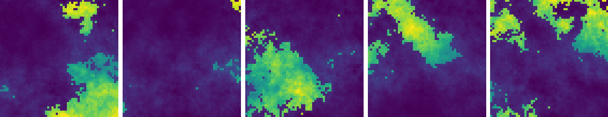
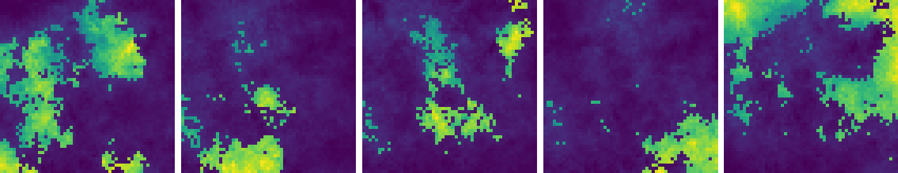
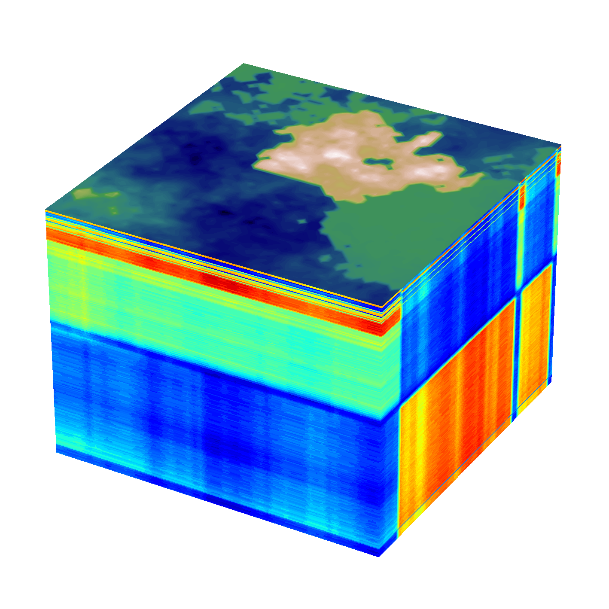
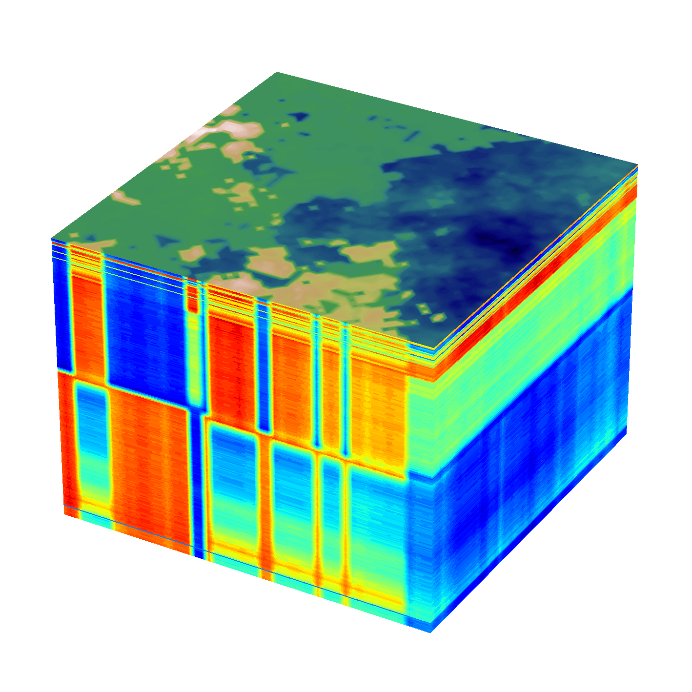
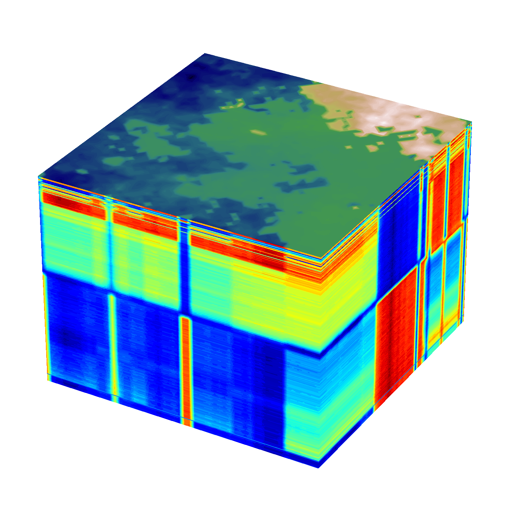
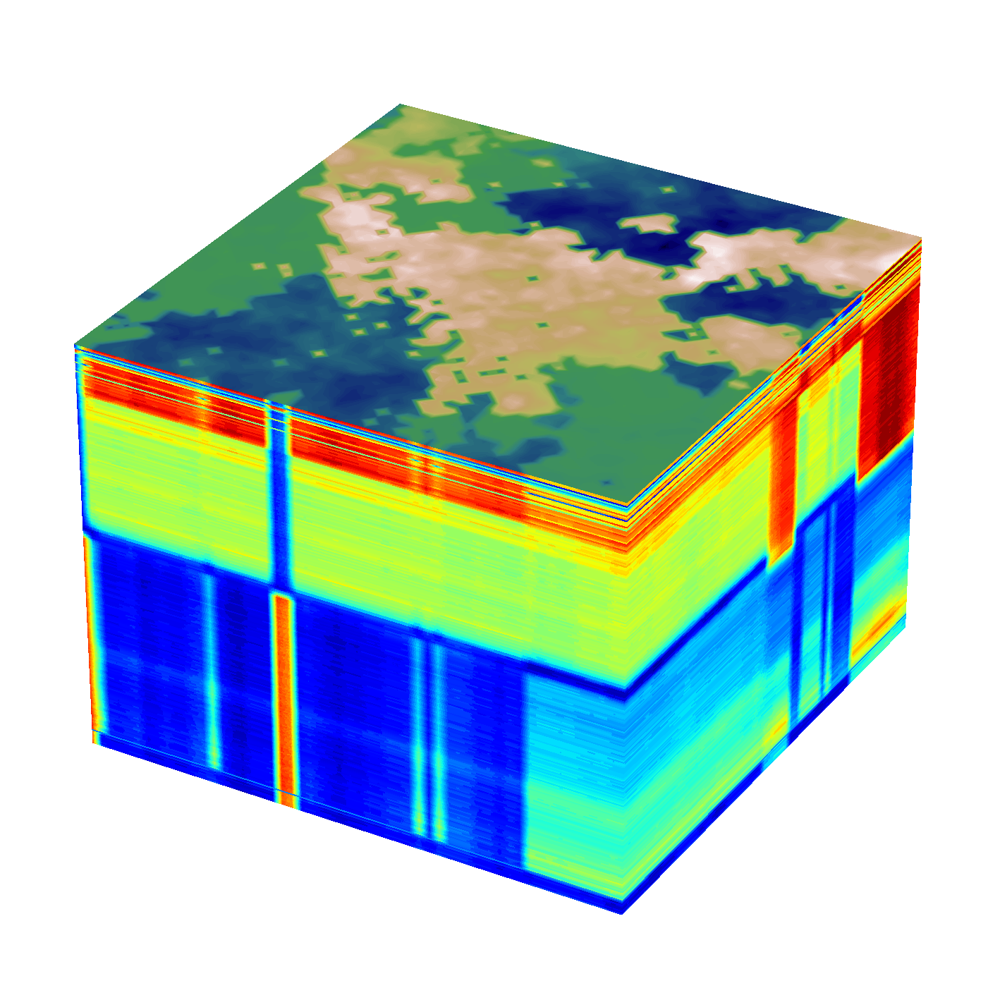
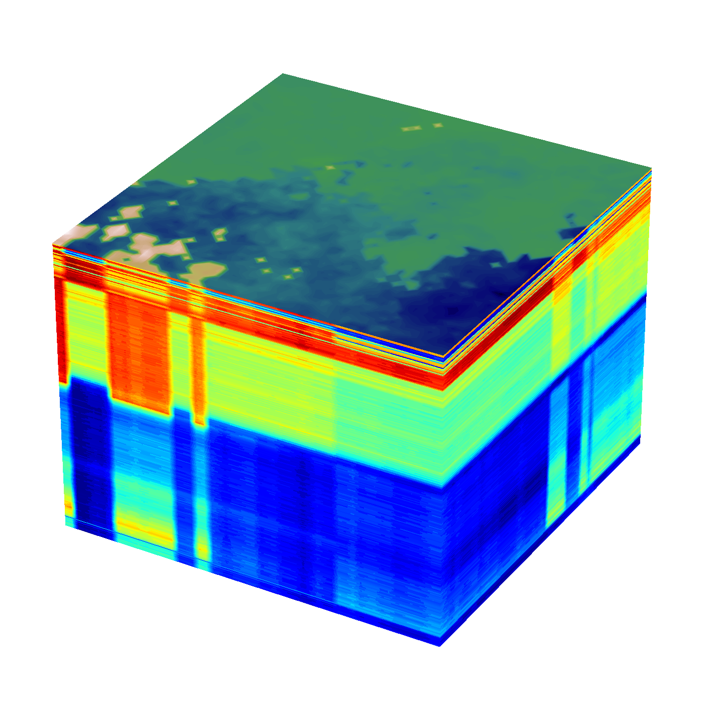
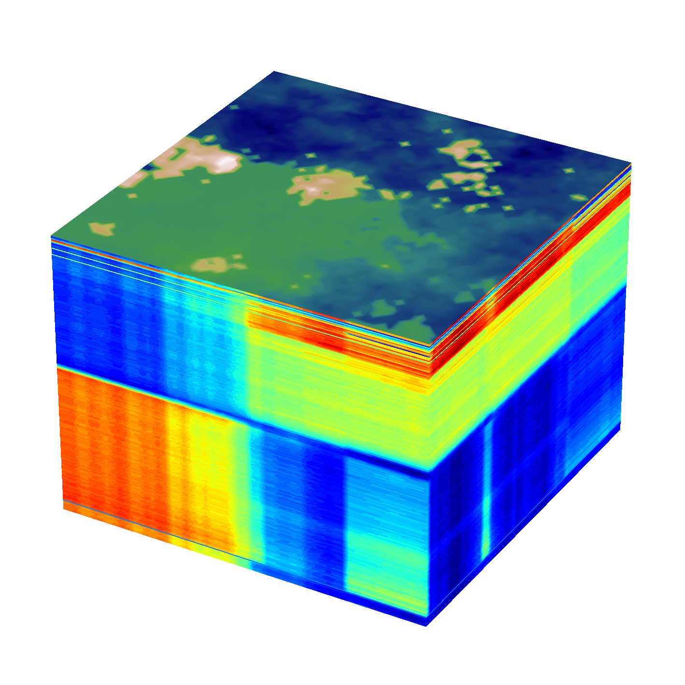

# PSU Cover Crop Hyperspectral endmembers

## Original Endmembers

|       |       clover |       canola |    triticale |        vetch |        soil |
|:------|-------------:|-------------:|-------------:|-------------:|------------:|
| count | 270          | 270          | 270          | 270          | 270         |
| mean  |   0.0865     |   0.0579549  |   0.0529853  |   0.0741493  |   0.0379507 |
| std   |   0.0765744  |   0.043307   |   0.0408682  |   0.0622283  |   0.0184529 |
| min   |   0.00587496 |   0.00856252 |   0.00545438 |   0.00696511 |   0.0100101 |
| 25%   |   0.0111644  |   0.0168026  |   0.0149993  |   0.0136519  |   0.0233929 |
| 50%   |   0.0314678  |   0.0303935  |   0.0260418  |   0.0295585  |   0.0332244 |
| 75%   |   0.170982   |   0.107055   |   0.0983534  |   0.142131   |   0.055876  |
| max   |   0.229851   |   0.128893   |   0.131124   |   0.196383   |   0.0841242 |

---

## Normalized Endmembers

|       |      clover |      canola |   triticale |       vetch |       soil |
|:------|------------:|------------:|------------:|------------:|-----------:|
| count | 270         | 270         | 270         | 270         | 270        |
| mean  |   0.359972  |   0.410472  |   0.378222  |   0.354688  |   0.376994 |
| std   |   0.341887  |   0.359899  |   0.325205  |   0.328524  |   0.24898  |
| min   |   0         |   0         |   0         |   0         |   0        |
| 25%   |   0.0236163 |   0.0684787 |   0.0759526 |   0.0353018 |   0.18057  |
| 50%   |   0.114266  |   0.181424  |   0.163822  |   0.119278  |   0.313224 |
| 75%   |   0.737165  |   0.818516  |   0.739234  |   0.713586  |   0.618855 |
| max   |   1         |   1         |   1         |   1         |   1        |

---

# Abundance Maps (randomized proportions)

(clover, canola, triticale, vetch, soil)

 
 
 
 
 
 
 
 
 
 

# Synthetic Datacubes

These synthetic HSI can be used for training.

The top layer is the average over all bands. It is an additional image overlaid on the datacube just for visualization.

